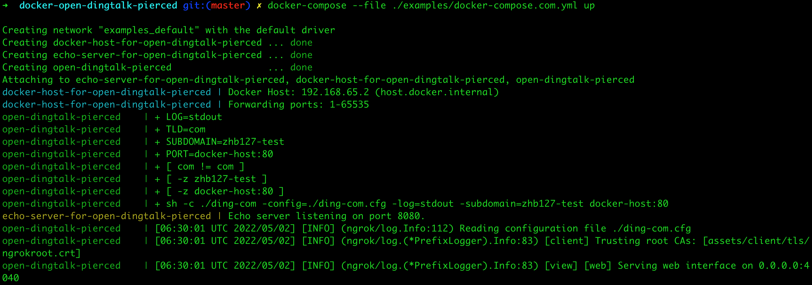

将[钉钉内网穿透工具](https://open-doc.dingtalk.com/microapp/kn6zg7/hb7000)封装成容器镜像，以便能够在不同的环境下使用 docker-compose 快速部署（`官方有说明，请勿用于生产环境`）。

> 已自动更新容器镜像到 [docker hub](https://hub.docker.com/r/zhb127/open-dingtalk-pierced)。

## 使用说明

### 参数说明

| 参数 | 说明 |
| :-- | :-- |
| TLD | 顶级域名，可选：com、cn，默认：com，cn 是[此版本](https://github.com/open-dingtalk/dingtalk-pierced-client/blob/6812f273c06bd0fb1f4212bd420991a97072cf02/linux/ding.cfg)提供 |
| SUBDOMAIN | 附加到 `vaiwan.${TLD}` 的子域名。例如：SUBDOMAIN=zhb127，在服务启动成功后，可通过 `zhb127.vaiwan.${TLD}` 来访问被代理（穿透）的本地服务。|
| PORT | 被代理（穿透）的本地服务端口，例如：`8080`、`0.0.0.0:8081` 等。 |

注意事项：
- 由于主域名 `vaiwan.${TLD}` 唯一，因此，你所设置的 SUBDOMAIN 有可能已被他人占用了，建议：尽量使用特殊一点的 SUBDOMAIN 值（例如：`公司名+业务模块+环境`等格式的值）。
- 将工具封装成 docker 容器镜像后启动，从容器中访问宿主机 IP 时，MacOS、Linux 有所不同，这里我们统一借助 qoomon/docker-host 容器镜像来访问宿主机 IP。

### 启动 com 示例

```bash
docker-compose --file ./examples/docker-compose.com.yml up

// 删除示例容器
// docker-compose --file ./examples/docker-compose.com.yml down --remove-orphans
```

> 在切换测试 com、cn 的时候，启动容器了还是找不到 tunnel，需要重启一下容器。

访问 `http://localhost:4040`，进入界面管理。

访问 `http://zhb127-test.vaiwan.com`，输出本地示例服务 `echo server`，如下： 

```
Request served by f1901995a8cb

HTTP/1.1 GET /

Host: zhb127-test.vaiwan.com
Connection: keep-alive
Cache-Control: max-age=0
Upgrade-Insecure-Requests: 1
User-Agent: Mozilla/5.0 (Macintosh; Intel Mac OS X 10_15_7) AppleWebKit/537.36 (KHTML, like Gecko) Chrome/100.0.4896.127 Safari/537.36
Accept: text/html,application/xhtml+xml,application/xml;q=0.9,image/avif,image/webp,image/apng,*/*;q=0.8,application/signed-exchange;v=b3;q=0.9
Accept-Encoding: gzip, deflate
Accept-Language: zh-CN,zh;q=0.9,en;q=0.8,zh-TW;q=0.7
```



### 启动 cn 示例

```bash
docker-compose --file ./examples/docker-compose.cn.yml up

// 删除示例容器
// docker-compose --file ./examples/docker-compose.cn.yml down --remove-orphans
```

> 在切换测试 com、cn 的时候，启动容器了还是找不到 tunnel，需要重启一下容器。

访问 `http://localhost:4040`，进入界面管理。

访问 `http://zhb127-test.vaiwan.cn`，输出本地示例服务 `echo server`，如下： 

```
Request served by 27a223c1c533

HTTP/1.0 GET /

Host: zhb127-test.vaiwan.cn:8081
Accept-Encoding: gzip, deflate
Accept-Language: zh-CN,zh;q=0.9,en;q=0.8,zh-TW;q=0.7
Connection: close
Cache-Control: max-age=0
Upgrade-Insecure-Requests: 1
User-Agent: Mozilla/5.0 (Macintosh; Intel Mac OS X 10_15_7) AppleWebKit/537.36 (KHTML, like Gecko) Chrome/100.0.4896.127 Safari/537.36
Accept: text/html,application/xhtml+xml,application/xml;q=0.9,image/avif,image/webp,image/apng,*/*;q=0.8,application/signed-exchange;v=b3;q=0.9
```

